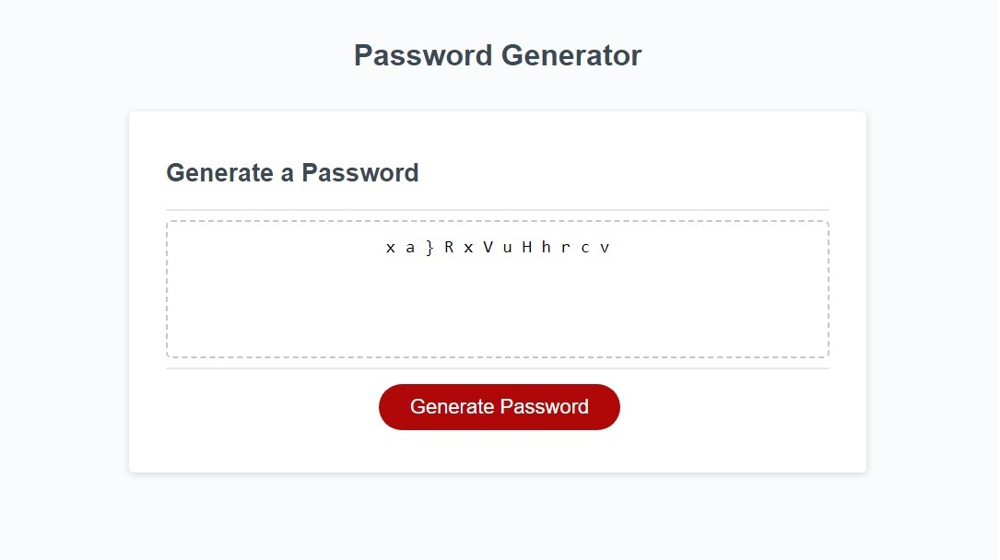
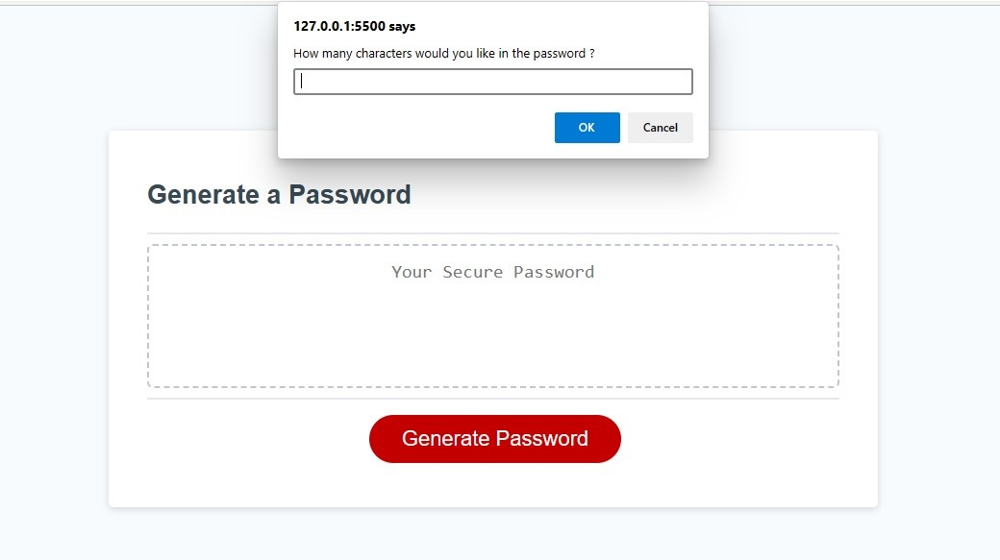
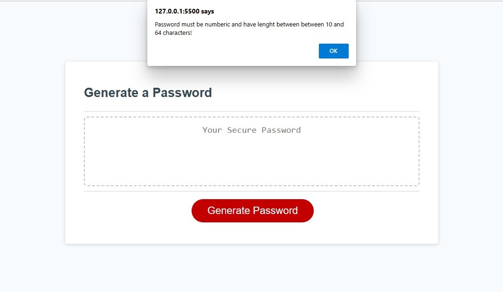
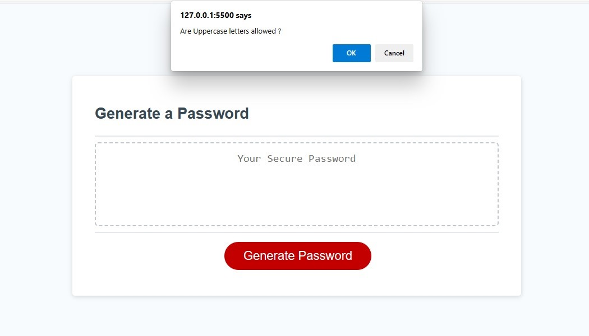

# Password-Generator
This project is about generating password based on the password length and character types selected by the user. The user starts the process by clicking on the password button as shown below:

## Data Entry
The user will be asked to enter a password length. The length will be validated against correct data type and range. If an incorrect selection is made a feedback message is displayed and the user will be invited to enter a password length again. The images below show both the data entry prompt and feedback message.

## Character Types
The user must select at least one of the four available character types. The user can select ower case letters, upper case letters, numbers and special characters. The user input is collected by confirmation of character types messages being displayed on an alert box(see figure below). If the user doesn't select a user type, a feedback message is displayed informing the user to at least select one character type.

## Processing
Following the user input. The application randomly selects a character type from user selection and then a random character is chosen. This process is repeated until the number of character are selected specified by the user. Finally, this collection of characters are formatted and displayed on the password splash screen. The following image shows an example of password being displayed.

## Application
Click the link below to view the application.
https://amoham1811.github.io/Password-Generator/